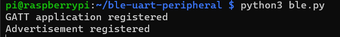

# TTpapercode

## BLE
To turn your raspberry pi into a BLE you need to take the 3 scripts from the *script* folder.

Put them in the same directory and type ``python3 ble.py`` to start the process

Once you see the printed lines as below, your raspberry pi is working as a BLE!

##Frontent
You need the index file and js scripts for the website.
The file called *script.js* will just send a **Hello, World!** message to the BLE.

The *ddosscript.js* is meant for the ddos, you need to link this to the *index.html* instead of the *script.js*